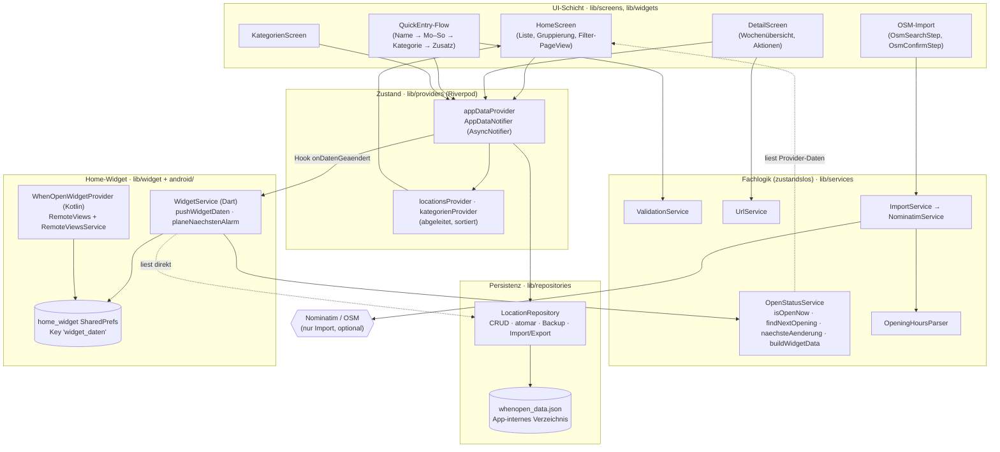
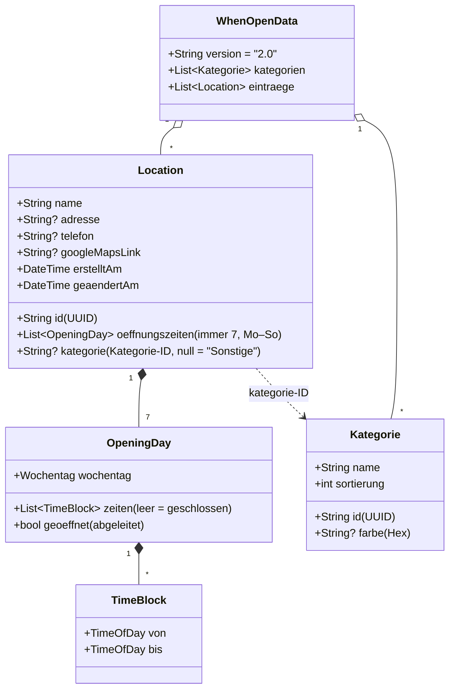
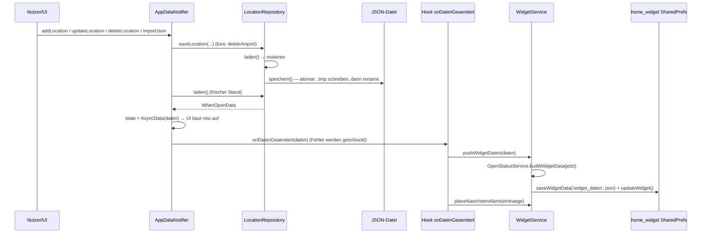
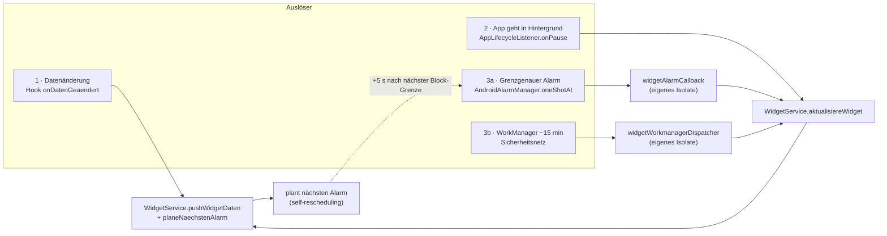

# 1.4 Technische Architektur — WhenOpen

**Erstellt:** 2026-06-11
**Bezug:** Code-Stand P10 Schritt 2 (`02-MVP/when_open/`), Spezifikation [`1.1-spezifikation.md`](1.1-spezifikation.md), Scope-Entscheidungen [`1.3-scope-entscheidungen.md`](1.3-scope-entscheidungen.md)
**Zweck:** Verständnis der Bausteine und ihres Zusammenspiels — für neue Sessions, Code-Review und spätere Erweiterungen (v2).

> Diese Doku beschreibt **wie** die App gebaut ist. **Was** sie können soll, steht in 1.1/1.3; **was je Arbeitspaket gebaut wurde**, in [`../02-MVP/inkremente.md`](../02-MVP/inkremente.md).

---

## 1. Überblick in drei Sätzen

WhenOpen ist eine reine **Android-Flutter-App ohne Backend**: Sie speichert persönliche Öffnungszeiten als **lokale JSON-Datei** und zeigt per App **und Home-Widget** auf einen Blick, was gerade offen ist. Die gesamte Fachlogik („jetzt offen?", „nächste Öffnung", „wann ändert sich der Status?") ist in **zustandslosen Services** gekapselt, die sowohl die UI als auch ein **Hintergrund-Isolate** für das Widget bedienen. Netzwerk wird **ausschließlich** für den optionalen OSM-Ortsimport benötigt — alles andere läuft offline.

---

## 2. Architekturprinzipien (die roten Fäden)

| Prinzip | Umsetzung im Code | Warum |
|---|---|---|
| **Klare Schichtung** | UI → Riverpod-Provider → Repository → JSON-Datei. Nur das `LocationRepository` berührt die Datei. | Mutationen haben *einen* Pfad; UI und Widget bleiben konsistent. |
| **Zustandslose Fachlogik** | `OpenStatusService`, `OpeningHoursParser`, `ValidationService`, `UrlService` sind `abstract final class` mit `static`-Methoden. **Zeit kommt immer als Parameter** — nie `DateTime.now()` in der Logik. | Jeder Zeitpunkt ist testbar; dieselbe Logik läuft im Hintergrund-Isolate ohne Flutter-Kontext. |
| **Austauschbarer Import** | `ImportService`-Interface; `NominatimService` ist nur eine Implementierung, via `importServiceProvider` injiziert. | App funktioniert vollständig ohne Import; v2 kann den Dienst tauschen, ohne die UI anzufassen. |
| **Datensicherheit vor Bequemlichkeit** | Atomare Schreibvorgänge (`write-then-rename`), Backup bei korrupter Datei, Validierung **vor** dem Überschreiben beim Import. | Ein Absturz oder eine kaputte Datei darf nie Bestandsdaten vernichten. |
| **Ereignisgetrieben statt Polling** | Widget-Update läuft per **grenzgenauem Alarm** auf die nächste Statusänderung, nicht per Minuten-Tick. | Akku-schonend; das Widget ist exakt zum Umschaltzeitpunkt korrekt. |
| **i18n-fähig von Anfang an** | Kein hartkodierter Anzeigetext; alle Strings über ARB (`l10n/`). | MVP ist deutsch, Struktur für weitere Sprachen steht. |

---

## 3. Schichtenmodell

**Lesehilfe:** Durchgezogene Pfeile = Aufruf-/Datenrichtung, gestrichelt = Lesezugriff. Auffällig ist der Pfeil unten rechts: Der **`WidgetService` liest im Hintergrund direkt aus dem Repository** — bewusst **an Riverpod vorbei**, weil das Widget-Update in einem eigenen Isolate ohne `ProviderScope` läuft (siehe §7).

---

## 4. Modul-/Verzeichnisübersicht

| Pfad | Verantwortung |
|---|---|
| `models/` | Reine Datentypen. `Wochentag`, `TimeBlock`+`OpeningDay` (E9-Zeitblöcke), `Kategorie` (E15), `Location` + `WhenOpenData` (JSON-Wurzel, Schema 2.0), `OpenStatus`/`NextOpening`/`WidgetData`/`WidgetEntry`. JSON via `json_serializable` (`*.g.dart`), Zeit-Konvertierung „HH:MM" manuell. |
| `services/` | Zustandslose Fachlogik (siehe §5/§6/§8). |
| `repositories/` | `LocationRepository` — einzige Stelle, die die Datei liest/schreibt (§9). |
| `providers/` | Riverpod-Verdrahtung: `locationRepositoryProvider`, `appDataProvider`/`AppDataNotifier`, abgeleitete `locationsProvider`/`kategorienProvider`. |
| `screens/` | Bildschirme inkl. `quick_entry/`-Unterflow (10 Schritte) und OSM-Schritte. |
| `widgets/` | Wiederverwendbare UI: `location_list_tile`, `kategorie_dialog`, `kategorie_sheets`, `undo_delete`. |
| `widget/` | Brücke zum Home-Widget: `widget_service` (Push + Alarm), `widget_background_callback` (WorkManager-Dispatcher). Das **native** Widget liegt in `android/`. |
| `theme/` | `AppColors` (markenfeste Farben), `AppPalette` als `ThemeExtension` für Hell/Dunkel, Zugriff über `context.col`. |
| `l10n/` | Generierte Lokalisierung (ARB → `app_localizations*`). |
| `app.dart` | `WhenOpenApp` + `go_router`-Konfiguration. |
| `main.dart` | Bootstrap: Lokalisierung, Alarm-/WorkManager-Init, Widget-Hook, Lifecycle-Listener. |

---

## 5. Datenmodell

**Schlüsselentscheidungen:**
- **Zeitblöcke statt einer Mittagspause (E9):** Eine Pause ist die *Lücke* zwischen zwei `TimeBlock`s. Mehrere Pausen = mehrere Blöcke. Es gibt kein eigenes `pause_von`/`pause_bis`.
- **Immer 7 Tage:** `Location` füllt fehlende Wochentage beim Konstruieren als „geschlossen" auf (`vervollstaendigeWoche`) — die Logik muss nie auf fehlende Tage prüfen.
- **Kategorie als ID-Referenz:** Umbenennen/Umfärben ändert nur die Kategorie, nicht die Einträge. „Sonstige" ist die implizite Auffang-Gruppe (`kategorie == null`), nicht löschbar.

---

## 6. Kern-Datenfluss: eine Änderung speichern

Jede Mutation (anlegen, bearbeiten, löschen, Kategorie ändern, importieren) läuft über **denselben Pfad** — das hält Liste *und* Widget konsistent:

Wichtig: Der Hook ist in `main.dart` gesetzt und in `AppDataNotifier._nachAenderung()` **in einen `try/catch` gehüllt** — ein fehlgeschlagener Widget-Push darf das Speichern nie scheitern lassen. Verpasste Updates fängt das WorkManager-Netz (§7) ab.

---

## 7. Widget-Aktualisierung (E16) — drei sich ergänzende Wege

Das ist der technisch anspruchsvollste Teil. Ab Android 8 sind `USER_PRESENT`-Receiver für Apps gesperrt, also kann das Widget sich nicht „beim Entsperren" selbst aktualisieren. Lösung: **drei Mechanismen, kein Polling.**

- **Weg 1 — Datenänderung:** sofort frische Widget-Daten schreiben (siehe §6).
- **Weg 2 — App in den Hintergrund:** `onPause` schreibt frisch, damit das Widget beim nächsten Blick stimmt.
- **Weg 3a — Grenzgenauer Alarm:** `OpenStatusService.naechsteAenderung()` liefert die *kleinste echt zukünftige Block-Grenze heute* (sonst Mitternacht). `AndroidAlarmManager.oneShotAt` weckt **+5 s danach** auf, rechnet neu und **plant sich selbst wieder ein**. So ist das Widget exakt zum Umschaltmoment korrekt — ohne Minuten-Ticks.
- **Weg 3b — WorkManager (~15 min):** Sicherheitsnetz für verschluckte Alarme (Doze, Neustart). `rescheduleOnReboot` stellt den Alarm nach einem Reboot wieder her.

Beide Hintergrund-Einstiegspunkte (`widgetAlarmCallback`, `widgetWorkmanagerDispatcher`) sind mit `@pragma('vm:entry-point')` markiert und laufen in **separaten Isolates** ohne `ProviderScope`. Deshalb liest `WidgetService.aktualisiereWidget()` **direkt** über `LocationRepository.imAppVerzeichnis()` aus der Datei — Riverpod existiert dort nicht.

---

## 8. Status-Berechnung „jetzt offen?" (E9)

`OpenStatusService.isOpenNow(location, now)` ist das Herz der App:

1. Wochentag aus `now` bestimmen, Tagesblöcke holen.
2. **Offen** ⇔ `von ≤ jetzt < bis` für **irgendeinen** Block. Rückgabe: „schließt um `bis`".
3. Sonst: gibt es heute noch einen *späteren* Block (nach einer Pause)? → „geschlossen, öffnet heute um …".
4. Sonst: `findNextOpening()` sucht den nächsten geöffneten Tag (heute+1 … heute+7) → „morgen/Mi ab …".
5. Kein Tag geöffnet → „keine Zeiten".

**Grenzfall-Konvention:** exakt `von` = offen, exakt `bis` = geschlossen. `naechsteAenderung()` nutzt dieselben Block-Grenzen als Aufwach-Zeitpunkte (§7) — Stufenfunktion und Scheduling teilen sich eine Quelle der Wahrheit.

---

## 9. Persistenz & Datensicherheit

`LocationRepository` ist die **einzige** Stelle mit Dateizugriff. Garantien:

- **Atomares Schreiben:** erst nach `…json.tmp`, dann `rename` auf die Zieldatei. Auf Android (POSIX) ersetzt `rename` atomar; ein Absturz mitten im Schreiben lässt die alte Datei intakt. (Windows-Tests: Fallback `delete`+`rename`.)
- **Korrupte Datei:** `laden()` fängt `FormatException`/Cast-Fehler, **benennt die kaputte Datei in `whenopen_backup_<ts>.json` um** und startet leer; die UI zeigt einmalig einen Hinweis (`letzterLadefehler`).
- **Import (Wiederherstellen):** `importJson()` validiert die Struktur (`version` + Liste `eintraege`) und parst das Schema **vor** dem Schreiben; erst dann wird die aktuelle Datei gesichert und ersetzt. Ein ungültiges Backup lässt die Bestandsdaten unangetastet.
- **Export/Sicherung:** `exportKopie()` schreibt eine datierte `whenopen-sicherung-<datum>.json` ins Temp-Verzeichnis für den System-Teilen-Dialog (Drive/Mail/Dateien).

---

## 10. Querschnittsthemen

- **Routing & Deep-Links (`app.dart`):** `go_router` mit `/`, `/detail/:id`, `/quick-entry`, `/open/:id`. Letzteres ist der **Deep-Link-Einstieg** des Widgets: Ein Zeilen-Tap im Widget feuert `whenopen://app/open/<id>` → Redirect → Detailansicht.
- **Hintergrund-Isolates:** zwei `vm:entry-point`-Callbacks (Alarm + WorkManager), beide ohne Flutter-/Riverpod-Kontext, beide bedienen sich derselben zustandslosen Services.
- **Lokalisierung:** alle Texte über ARB; im Isolate via `lookupAppLocalizations(Locale('de'))` ohne `BuildContext` nutzbar. Datumsformate brauchen `initializeDateFormatting('de')` in `main()`.
- **Theme (P10):** Markenfarbe **Indigo #6366F1**, `AppPalette` als `ThemeExtension` mit Hell- und Dunkel-Instanz; markenfeste Farben (Status, Kategorie) bleiben Konstanten, nur Neutrale kippen. Hell-Modus flächendeckend ist noch offen.

---

## 11. Externe Abhängigkeiten (und warum)

| Paket | Zweck | Anmerkung |
|---|---|---|
| `flutter_riverpod` | App-Zustand | einziger Mutationspfad |
| `go_router` | Navigation + Deep-Links | Widget→Detail |
| `home_widget` | Brücke Dart ↔ natives Widget | SharedPrefs-Transport |
| `android_alarm_manager_plus` | grenzgenauer Alarm (E16) | Service/Receiver **manuell** im Manifest (Plugin-Merge unzureichend) |
| `workmanager` | periodisches Netz (E16) | ~15 min, Doze-bewusst |
| `json_serializable` | JSON ↔ Modelle | generiert `*.g.dart` |
| `http` | OSM-Import | einziger Netzaufruf |
| `path_provider` | App-Verzeichnis | Datei + Temp |
| `url_launcher` | Maps/Tel/Geo öffnen | `<queries>` im Manifest (Android 11+) |
| `share_plus` | Sicherung teilen | System-Teilen-Dialog |
| `uuid`, `intl` | IDs, Datums-/Zeitformat | — |

**Release-Hinweis (P09-Fix):** R8/Minification ist **aus** — der Reflexions-Code von WorkManager/Room wurde sonst gestrippt und crashte release-only beim Start. Bei späterer Reaktivierung: Keep-Regeln + Gerätetest.

---

## 12. Teststrategie

- **TDD für Fachlogik:** Services, Repository und Parser haben Unit-Tests (Stand: **58 grün**). Zeit wird injiziert → jeder Grenzfall ist deterministisch (Mehrblock-Tag, Sa-23:59→Mo, „nie geöffnet", Import-/Backup-Pfade).
- **Import-Dienst injizierbar:** `importServiceProvider` lässt sich in Tests durch einen Fake ersetzen — keine echten Netzaufrufe.
- **„Fertig" = Tests grün UND App läuft am Emulator** (Pixel_API35). Release-Builds werden zusätzlich am Gerät/Emulator geprüft (R8-Crashes sind im Debug unsichtbar).

---

## 13. Bewusste Grenzen & Erweiterungspunkte

| Heute (MVP) | Erweiterungspunkt (v2) |
|---|---|
| Textbasierte Nominatim-Suche, ~80 % `opening_hours`-Parser | GPS-Umkreissuche via Overpass; nachgelagerter POI-Lookup → siehe [`1.5-suche-gps-evaluation.md`](1.5-suche-gps-evaluation.md) |
| Ein Standort, alphabetische Liste | Multi-Standort/Städte (E12) — Architektur ist darauf vorbereitet |
| Nur Android, nur Deutsch | iOS (Flutter), weitere Sprachen (ARB steht) |
| Lokale JSON-Datei | bewusst kein Cloud-Sync (Datenschutz-Versprechen) |
| `ImportService` = Nominatim | Interface erlaubt Tausch (HERE, Overpass, …) ohne UI-Änderung |

---

*Diagramme sind in [Mermaid](https://mermaid.js.org) notiert und rendern direkt auf GitHub. Bei Code-Änderungen diese Doku mitziehen — sie ist die „Karte", `inkremente.md` das „Logbuch".*
